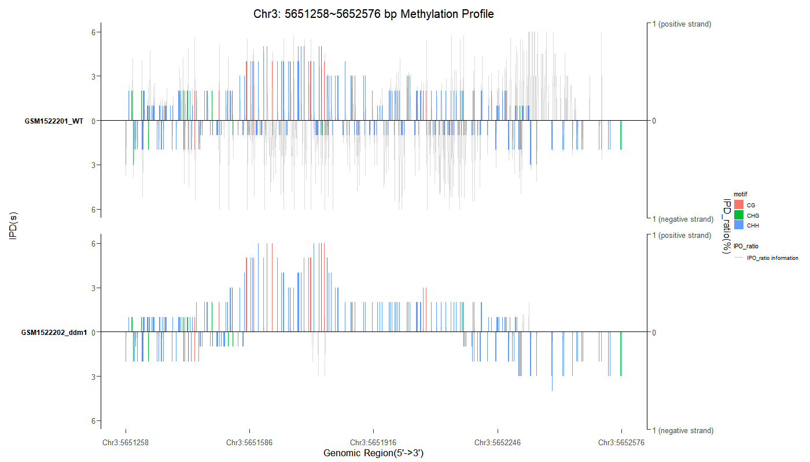
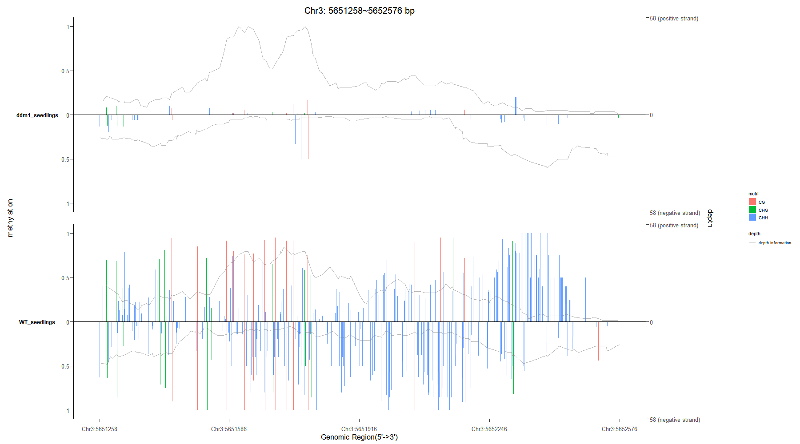
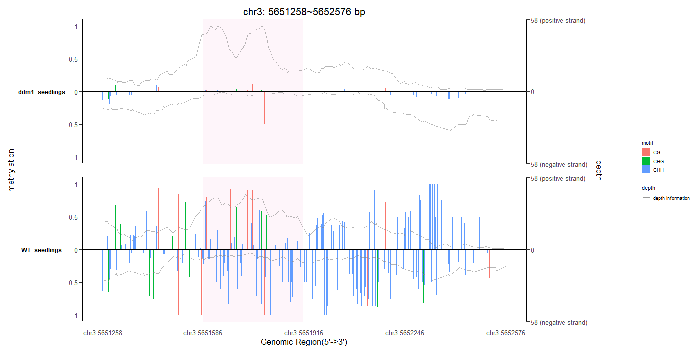

<!-- README.md is generated from README.Rmd. Please edit that file -->

# BMplot: Base Modification Visualization

<!-- badges: start -->
<!-- badges: end -->

This package implements functions to visualize the profile of base
modification in both DNA and RNA.

## Introduction

Biology relies heavily on epigenetics as a method of altering genetic
information without altering nucleic acids.

Many methods are used to detect the epigenetic status with the
combination of sequencing and chemical methods, such as `Me‑DIP` and
`oxBS‑seq` for `5mC`; `TAB-seq` and `hme‑DIP` for `5hmC`; `6mA‑DIP` and
`6mA‑RE-seq` for `6mA`. Aside from these, third-generation sequencing
methods, which refer to direct single-molecule sequencing, such as
Oxford Nanopore Sequencing and PacBio SMRT Sequencing, can detect
epigenetic status at single-base resolution. BMplot is designed to
visualize single-base resolution epigenetic data by considering the
strand, motif, and additional information.

BMplot provides two functions to visualize the base modification.
`getBaseModificationDf()` gets the information about base modification
in each base and organizes it into a data frame.
`plotBaseModificationProf()` can return an ggplot object that can be
used to visualize the base modification using the data frame returned by
`getBaseModificationDf()`.

## `bmData` object preparation

Any regions of user intesets could be visualized in BMplot. With the
data provided by users, BMplot creates the `bmData` object to store
comprehensive information about base modifications in DNA or RNA.

DNA methylation is one of the base modifications that plays an important
role in various biological processes. As the differentially methylated
regions (DMR) are most of the command interests, here we use the data
from WGBS (whole-genome bisufile sequencing) as the showcase to show how
to prepare the `bmData` object in BMplot.

bmData object is similar to BSseq object, storing any base modification
information, like IPD value\[@flusberg2010direct\] and so on, for the
reason that BSseq object can only store information of methylation and
read depth. There are three functions provided by `BMplot` including one
constructor and two functions enclosing the constructor.

`bmData()` is the constructor of bmData object. Users can organize the
data of interest into matrix-like object. For brief, users should
extract each kind of value from the combined results. For example, users
may get the combined results in the form of two matrix-like objects.
Each object represent one sample and contain two value, like methylation
value and depth value. User should first extract the methylation value
from each sample and organize all the methylation value into one
matrix-like object. Then do the same thing to depth value.

``` r
bmData <- function(value1 = NULL, value2 = NULL,
                   pos = NULL, chr = NULL, gr = NULL,
                   sampleNames = NULL, valueNames = NULL,
                   ...)
```

For the sake of convenience, `BMplot` provide two functions encloseing
the constructor. Users can use `makebmDataFromData()` to make bmData
object from data. The data should be organized in one of the `Granges`,
`GrangeList`, `data.frame` and `list` structure.

``` r
# simulated grange and grangelist object
files <- getSampleFiles()

gr1 <- readPeakFile(files[[4]])
mcols(gr1)[[1]] <- runif(length(gr1))

# make bmData from grange object
dmData_grange <- makebmDataFromData(data = gr1, 
                                    sampleNames = c("GSM1295076_CBX6_BF"))


# make bmData from grangelist
gr2 <- readPeakFile(files[[5]])
mcols(gr2)[[1]] <- runif(length(gr2))
gr_list <- GRangesList(gr1,gr2)

dmData_grangelist <- makebmDataFromData(data = gr_list,
                                        sampleNames = c("GSM1295076_CBX6_BF",
                                                        "GSM1295077_CBX7_BF"))

# make bmData from data.frame
df <- data.frame(chr=as.character(seqnames(gr1)),pos=start(gr1),
                 value1= mcols(gr1)[[1]], value2= mcols(gr1)[[2]])

df_bmData <- makebmDataFromData(data = df, 
                                sampleNames = c("GSM1295076_CBX6_BF"))


# make bmData from list
df2 <- data.frame(chr=as.character(seqnames(gr2)),pos=start(gr2),
                  value1= mcols(gr2)[[1]], value2= mcols(gr2)[[2]])

df_list <- list(df,df2)

df_list_bmData <- makebmDataFromData(data = df_list,
                                     sampleNames = c("GSM1295076_CBX6_BF",
                                                     "GSM1295077_CBX7_BF"))
```

Users can also use `makebmDataFromFiles()` to make bmData object from
file.

``` r
filefolder <- SampleFileFolder()

# test folder with bed files
bed_folder_bmData <- makebmDataFromFiles(name = filefolder[[1]],
                                         sampleNames = c("GSM1295076_CBX6_BF",
                                                         "GSM1295077_CBX7_BF"),
                                         variablesNames = c("IPD_ratio","IPD"))

bedfile <- SamepleBedFiles()
# test bed file
bed_bmData <- makebmDataFromFiles(name = bedfile[[1]],
                                  sampleNames = c("GSM1295076_CBX6_BF"),
                                  variablesNames = c("IPD_ratio","IPD"))


# test folder with txt files
txt_folder_bmData <- makebmDataFromFiles(name = filefolder[[2]],
                                         sampleNames = c("GSM1295076_CBX6_BF",
                                                         "GSM1295077_CBX7_BF"),
                                         variablesNames = c("IPD_ratio","IPD"))


txt_file <- SamepleTxtFiles()
# test txt file
txt_bmData <- makebmDataFromFiles(name = txt_file[[1]],
                                  sampleNames = c("GSM1295076_CBX6_BF"),
                                  variablesNames = c("IPD_ratio","IPD"))
```

`bmData` object can store any base modification data regardless of the
size of the data. `simulated_IPO` is the simulated data packed in the
BMplot.

``` r
bmData_A_thaliana <-  makebmDataFromData(data = simulated_IPO,
                                         sampleNames = c("GSM1522201_WT",
                                                         "GSM1522202_ddm1"))

bmData_df <- getBaseModificationDf(region = A_thaliana_dmR[1,],
                                   input = bmData_A_thaliana,
                                   BSgenome = BSgenome.Athaliana.TAIR.TAIR9::Athaliana,
                                   motif = c("CG","CHH","CHG"),
                                   base = "C")

png("bmdata.png",width = 1400,height = 800 )
plotBaseModificationProf(bmData_df,switch_y_value = F,
                         ylab = "IPD(s)",second_ylab = "IPD_ratio(%)")
```



## Base modification information extraction.

For a better experience, we made some example data for users to go
through BMplot. Here, we extracted the information from the `bmData`
object and mapped it to the sequence data stored in
`BSgenome.Athaliana.TAIR.TAIR9` by providing the base and motif of our
interest.

``` r
library(BSgenome.Athaliana.TAIR.TAIR9)
BSgenome_thaliana <- BSgenome.Athaliana.TAIR.TAIR9

# A_thaliana_dmR and A_thaliana_BSobj are internal sample data
thaliana_df <- getBaseModificationDf(region = A_thaliana_dmR,
                                     BSgenome = BSgenome_thaliana,
                                     input = A_thaliana_BSobj,
                                     base = "C",
                                     motif = c("CG","CHG","CHH"))
```

The data frame has six columns. `coordinate` refers to the coordinates
of each base in the region; `motif` refers to the motif of the
methylation; `strand` refers to the strand information of the base
modification; `sample` refers to the sample name of each sample; `value`
refers to the coverage of each base or the methylation level of each
position; `type` decides whether the category should be coverage or
methylation level.

## Base modification visualization

``` r
plotBaseModificationProf(thaliana_df,switch_y_value = T)
```



## Additional information visualization

### Highlight

Users can use the parameter of highlight_lim to emphasize the regions in
`BMplot`.

``` r
plotBaseModificationProf(thaliana_df,switch_y_value = T,
                         highlight_lim = c(5651586,5651913))
```

 This highlight function can also be
applied to list regions.

``` r
BSgenome_human <- BSgenome.Hsapiens.UCSC.hg19
df_list <- getBaseModificationDf(region = Human_dmR[1:2,],
                                 BSgenome = BSgenome_human,
                                 input = Human_BSobj,
                                 base = "C",
                                 motif = c("CG","CHH","CHG"))

plotBaseModificationProf(df_list,nrow = 1,switch_y_value = T,
                         highlight_lim = list(c(1100262,1100463),
                                              c(1173154,1173300)))
```


### Gene track

Users can add the gene track in addition to the profile of base
modification. The `GeneModel` parameter allows users to plot the gene
track of a chosen database. The `ggbio` was used to plot the gene track
in accordance with the `GeneModel` parameter. `GeneModel` can be an
OrganismDb object, TxDb object, EnsDb object, or GrangeList object.

``` r
library(TxDb.Hsapiens.UCSC.hg19.knownGene)
library(BSgenome.Hsapiens.UCSC.hg19)
BSgenome_human <- BSgenome.Hsapiens.UCSC.hg19
txdb <- TxDb.Hsapiens.UCSC.hg19.knownGene

region <- Human_dmR[1,]
region <- region[,c(1:3)]
region[1,c(2,3)] <- c(10000,25000)
human_df <- getBaseModificationDf(region = region,
                                  BSgenome = BSgenome_human,
                                  input = Human_BSobj,
                                  base = "C",
                                  motif = c("CG","CHH","CHG"))

plotBaseModificationProf(human_df,
                         switch_y_value = T,
                         GeneModel = txdb,
                         highlight_lim = c(10497,11000))
```


## Installation

You can install the development version of BMplot from
[GitHub](https://github.com/) with:

``` r
# install.packages("devtools")
devtools::install_github("YuLab-SMU/BMplot")
```
